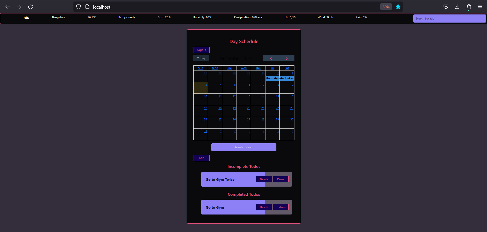

# Day Planner App
Welcome to Day Planner – an all-in-one web application designed to enhance your productivity and streamline your daily activities. This project integrates a powerful Todo system, real-time weather updates, and an intuitive calendar interface for effective task management. Stay organized, stay informed, and stay productive with my feature-rich web application.

**Key Features:**
- 📝 **Todo Functionality:** Create, edit, and manage your tasks seamlessly.
- 🌦️ **Weather Integration:** Stay updated with real-time weather information.
- 📅 **Calendar Integration:** Efficiently manage your schedule with FullCalendar.
- 🚀 **Ocelot Integration (Coming Soon):** Simplify API management with Ocelot.
- ⚡ **GraphQL for Efficient Data Consumption (Coming Soon):** Optimize data retrieval for a faster user experience.


[](LICENSE)



# Project Features

- **Todo Functionality**

    - The project incorporates a robust Todo functionality that allows users to manage their tasks efficiently. The Todo system utilizes a locally created API to handle task creation, editing, and deletion. Users can seamlessly interact with the Todo interface to enhance their productivity.

- **Weather Functionality**

    - Stay informed about the weather with our integrated Weather functionality. The project leverages the [WeatherAPI](https://www.weatherapi.com/) to provide real-time weather updates. Users can access accurate weather information, including temperature, conditions, and more, to plan their activities accordingly.

- **Calendar Integration with FullCalendar**

    - Efficiently manage your schedule with the integrated calendar functionality powered by [FullCalendar](https://fullcalendar.io/). The FullCalendar library enhances the user experience, providing an interactive and visually appealing calendar interface. Users can easily schedule, view, and organize their events with drag-and-drop features and intuitive navigation.

- **Ocelot Integration**

    - *Coming Soon!* The project is set to integrate [Ocelot](https://ocelot.readthedocs.io/), a versatile API Gateway for .NET. Ocelot simplifies the management of API routes, enhances security, and improves overall performance. Stay tuned for updates on Ocelot integration in our project.

- GraphQL for Efficient Data Consumption

    - To optimize data consumption and reduce unnecessary requests, the project will soon incorporate GraphQL. GraphQL enables clients to request only the data they need, leading to more efficient communication between the client and server. This enhancement aims to provide a faster and more responsive user experience.


## Pre-requisites

The following items should be installed on your machine:

:heavy_check_mark: Docker          (Containerization)
:heavy_check_mark: Docker Compose  (Service Orchestration Locally)
:heavy_check_mark: NodeJS          (API and GUI Development)
:heavy_check_mark:.NET Core       (API Gateway Development)


## Technology Stack

:heavy_check_mark: Node JS  
:heavy_check_mark: ReactJS  
:heavy_check_mark: Redux  
:heavy_check_mark: Express JS  
:heavy_check_mark: Ocelot  
:heavy_check_mark: GraphQL  
:heavy_check_mark: PostgreSQL  

## Install

Before you can start developing you need to complete the following steps:
* Create a ".env" file from the ".env.template" template
* Go to folder "/server" and run `npm i`
* Go to folder "/frontend" and run `npm i`

Maybe you get the following error when trying to complete the last step:
`Error: Missing binding /usr/src/web/node_modules/node-sass/vendor/linux_musl-x64-64/binding.node`.  
While the containers are still running open another terminal and execute the following:
`docker-compose exec web npm rebuild node-sass`.

Then run `docker-compose down` and `docker-compose up` again.


## Running Application

To install NPM packages for the frontend and server directory execute the following command inside the both directory `npm install`.

To run the following on the project root directory:

```sh
docker-compose up --build
```


You can connect to the database via *PG-Admin* by entering the connection details from the ".env" file and you can also edit the "schema.sql" file in the "init-scripts" folder.